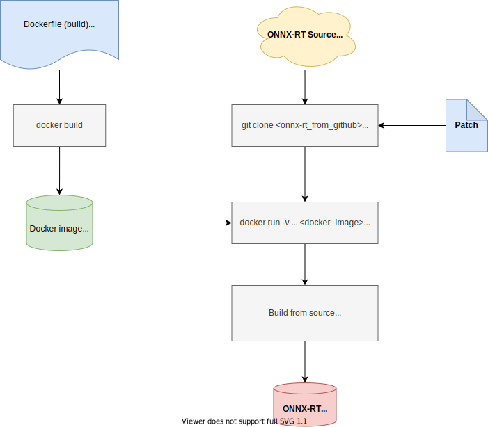
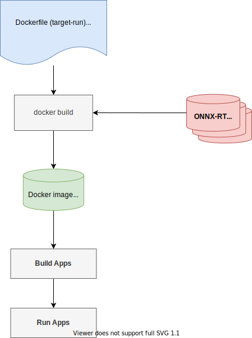

QEMU-based DL Runtime Build for J7 Target Docker Containers
===========================================================

## Overview
Currently this covers building *ONNX-RT* and *FTLite-RT* from source for Ubuntu 18.04 (tested) and Ubuntu 20.04 (not yet tested) Docker containers, but it should be straightforward to extend to other DL-RT like TVM-DLR. This is for PSDK 8.0 release. For other release, patches and settings should be updated accordingly.

### DL Runtime Library Packages

|         | x86_64 Ubuntu 18.04  | aarch64 J7 PSDK-Linux | aarch64 Ubuntu 18.04 | aarch64 Ubuntu 20.04 | aarch64 Debian   |
| ------- | -------------------- | --------------------- | -------------------- | -------------------- | ---------------- |
| DLR     | .whl from TIDL build | .ipk from Ycoto build | Not yet covered      | Not yet covered      | Not yet covered  |
| ONNX-RT | .whl from TIDL build | .ipk from Ycoto build | .so & .whl from This | .so & .whl from This | Not yet covered  |
| TFL-RT  | .whl from TIDL build | .ipk from Ycoto build | .a from This         | .a from This         | Not yet covered  |

### Build DL Runtime using QEMU on PC


### Build & Run Apps in Target Docker Container: To be covered in Edge AI / Robotics SDK


## Clone GIT repo
```
git clone <this_repo_url>
cd dlrt-build
WORK_DIR=$(pwd)
```

After pulling the source (see below), the folder structure looks like below:
```
.
├── docker
│   ├── Dockerfile-arm64v8-ubuntu18-py36-gcc9
│   ├── Dockerfile-arm64v8-ubuntu20-py38-gcc9
│   ├── docker_build.sh
│   ├── docker_run.sh
│   ├── entrypoint.sh
│   └── setup_proxy.sh
├── docs
│   ├── dlrt_build_qemu.svg
│   └── target_docker.svg
├── onnxruntime_              # ONNX-RT source folder
├── tensorflow                # Tensorflow source folder
├── patches
│   ├── onnxrt
│   └── tflite
├── README.md
├── qemu_init.sh
├── onnxrt_build.sh
├── onnxrt_deploy.sh
├── onnxrt_prepare.sh
├── onnxrt_protobuf_build.sh  # Optional
├── tflite_build.sh
├── tflite_deploy.sh
└── tflite_prepare.sh
```

## Docker Environment for Building

### Initialize QEMU to Emulate ARM Architecture on x86 Ubuntu PC
If QEMU was not installed on the build Ubuntu PC,
```
sudo apt-get install -y qemu-user-static
```

To initialize the QENU,
```
./qemu_init.sh
```

### Build Docker Image for Building
```
cd docker
./docker_build.sh
```

**TI Proxy**: The script and Dockerfile should be also run inside TI network. All the necessary proxy setting are provided.

It will take several minutes building the Docker image. After "`docker build`" completed, you can check the resulting docker image:
```
$ docker images
REPOSITORY                   TAG         IMAGE ID       CREATED             SIZE
arm64v8-ubuntu18-py36-gcc9   latest      6f545823db99   36 seconds ago      768MB
```

<!-- ======================================= -->
## Build ONNX-RT from Source

### Prepare the Source, Update Config

Update `PROTOBUF_VER` in `onnxrt_prepare.sh` by, e.g., checking "`git log`" at `onnxruntime/cmake/external/protoc`. Currently it is set:
`PROTOBUF_VER=3.11.3`.


You can run the following in the Ubuntu PC command-line for downloading source from git repo, applying patches, and downloading pre-built `protobuf`:
```
cd $WORK_DIR
./onnxrt_prepare.sh
```

### Build
Update `PROTOBUF_VER` to match to the setting in `onnxrt_prepare.sh`. The following should be run in the Docker container with QEMU.
```
cd $WORK_DIR/docker
./docker_run.sh
```

(Optional) To build `protobuf` from source, run the following inside the container.
```
./onnxrt_protobuf_build.sh
```

Update "`--path_to_protoc_exe`" in `onnxrt_build.sh` accordingly. To build ONNX-RT, run the following inside the container,
```
./onnxrt_build.sh
```

Outputs:
- Shared lib: `<onnxruntime>/build/Linux/Release/libonnxruntime.so.1.7.0`
- Wheel file: `<onnxruntime>/build/Linux/Release/dist/onnxruntime_tidl-1.7.0-cp36-cp36m-linux_aarch64.whl`


### Deploy to J7 Target
Update `J7_IP_ADDR` in `onnxrt_deploy.sh` for the IP address assigned to the J7 EVM. It's recommended to use a static IP for the EVM.

Run the following script in the Ubuntu PC command-line which will `scp` the resulting `.so` and `.whl` files to the target:
```
cd $WORK_DIR
./onnxrt_deploy.sh
```

<!-- ======================================= -->
## Build TFLite from Source

### Prepare the Source, Update config
You can run the following script in the Ubuntu PC command-line.
```
cd $WORK_DIR
./tflite_prepare.sh
```

### Build
To build the tensorflow from source, run the following in the Docker container with QEMU.
```
cd $WORK_DIR/docker
./docker_run.sh
```

Inside the container,
```
./tflite_build.sh
```

Outputs:
- Static lib: `<tensorflow>/tensorflow/lite/tools/make/gen/linux_aarch64/lib/libtensorflow-lite.a`
- Wheel file: TODO

### Deploy to J7 Target
Update `J7_IP_ADDR` in `tflite_deploy.sh`.

Run the following script in the Ubuntu PC command-line which will `scp` the resulting `.a` file to the target:
```
cd $WORK_DIR
./tflite_deploy.sh
```
