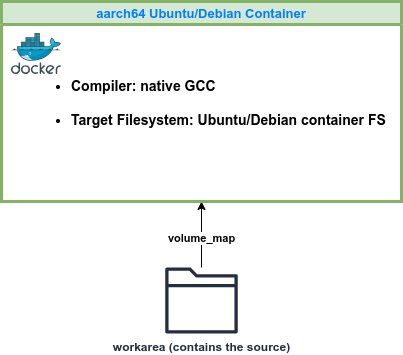

Open-Source Runtime Library Build for Target Ubuntu/Debian Container
====================================================================

This build system covers building *ONNX-RT*, *TFLite-RT*, *NEO-AI-DLR*, and *TIDL runtime modules* from source for Ubuntu/Debian systems running on TI's EdgeAI processors (TDA4VM, AM62A, AM67A, AM68A, and AM69A). Tested for aarch64 Ubuntu 22.04 and aarch64 Debian 12.5.

Supported use cases include:

- **Case 1**: Compiling with the native GCC in arm64v8 Ubuntu Docker container directly on aarch64 build machine
- **Case 2**: Compiling with the native GCC in arm64v8 Ubuntu Docker container on x86_64 machine using QEMU

<table>
  <tr>
    <td>
    
    </td>
  </tr>
</table>
<figcaption>Figure 1. Building in aarch64 Ubuntu/Debian Container</figcaption>

<!-- ======================================= -->
## Prerequisite

### docker-pull the base Docker image

Pull the baseline Docker image needed. Assuming outside of a proxy network,
```bash
docker pull arm64v8/ubuntu:22.04
docker pull arm64v8/ubuntu:20.04
docker pull arm64v8/debian:12.5
```

### edgeai-ti-proxy (only required to make the build system work in TI proxy network)

Set up `edgeai-ti-proxy` ([repo link](https://bitbucket.itg.ti.com/projects/PROCESSOR-SDK-VISION/repos/edgeai-ti-proxy/browse))

Before docker-build or docker-run, please make sure sourcing `edgeai-ti-proxy/setup_proxy.sh`, which will define the `USE_PROXY` env variable and all the proxy settings for the TI network.

### (Only for Case 2) Initialize QEMU to Emulate ARM Architecture on x86 Ubuntu PC
If QEMU was not installed on the build Ubuntu PC,

```bash
sudo apt-get install -y qemu-user-static
# to initialize the QENU
./qemu_init.sh
```

## Docker Environment for Building

### Docker-build
```bash
BASE_IMAGE=ubuntu:22.04 ./docker_build.sh
BASE_IMAGE=ubuntu:20.04 ./docker_build.sh
BASE_IMAGE=debian:12.5  ./docker_build.sh
```

### Docker-run
```bash
BASE_IMAGE=ubuntu:22.04 ./docker_run.sh
BASE_IMAGE=ubuntu:20.04 ./docker_run.sh
BASE_IMAGE=debian:12.5  ./docker_run.sh
```

<!-- ======================================= -->
## Git Tags for the Source Git Repositories

All Git tags and parameters compatible with a specific Processor SDK release are captured in `scripts/config.yaml`. Each script parses the relevant Git tags and parameters from this YAML file. Please note that any instructions for parameter updates provided below are for informational purposes only.

<!-- ======================================= -->
## Build ONNX-RT from Source

All the commends below should be run **in the Docker container**.

### Prepare the source and update the build config


You can run the following in the Docker container for downloading source from git repo, applying patches, and downloading pre-built `protobuf`:
```bash
./onnxrt_prepare.sh
```

### Build

The following should be run in the Docker container.

(Optional) To build `protobuf` from source, run the following inside the container.
```bash
./onnxrt_protobuf_build.sh
```

Update "`--path_to_protoc_exe`" in `onnxrt_build.sh` accordingly. To build ONNX-RT, run the following inside the container,
```bash
./onnxrt_build.sh
```

Outputs:
- Shared lib: `$WORK_DIR/workarea/onnxruntime/build/Linux/Release/libonnxruntime.so.1.15.0`
- Wheel file: `$WORK_DIR/workarea/onnxruntime/build/Linux/Release/dist/onnxruntime_tidl-1.15.0-cp310-cp310-linux_aarch64.whl`

### Package

```bash
./onnxrt_package.sh
```

Output tarball: `$WORK_DIR/workarea/onnx-1.15.0-ubuntu22.04_aarch64.tar.gz`

<!-- ======================================= -->
## Build TFLite-RT from Source

All the commends below should be run **in the Docker container**.

### Prepare the source and update the build config

```bash
./tflite_prepare.sh
```

### Build
```bash
./tflite_build.sh
```

To build the Python wheel package:
```bash
./tflite_whl_build.sh
```

Outputs:
- Static lib: `$WORK_DIR/workarea/tensorflow/tflite_build/libtensorflow-lite.a`
- Wheel file: `$WORK_DIR/workarea/tensorflow/tensorflow/lite/tools/pip_package/gen/tflite_pip/python3/dist/tflite_runtime-2.12.0-cp310-cp310-linux_aarch64.whl`

### Package
```bash
./tflite_package.sh
```

Output tarball: `$WORK_DIR/workarea/tflite-2.12-ubuntu22.04_aarch64.tar.gz`

<!-- ======================================= -->
## Build Neo-AI-DLR from Source

All the commends below should be run **in the Docker container**.

### Prepare the source and update the build config

```bash
./dlr_prepare.sh
```

### Build

```bash
./dlr_build.sh
```

### Package

```bash
./dlr_package.sh
```

Output wheel package: `$WORK_DIR/workarea/neo-ai-dlr/python/dist/dlr-1.13.0-py3-none-any.whl`

<!-- ======================================= -->
## Build TIDL Modules

TIDL runtime modules include TIDL-RT library, TFLite-RT delegate library and ONNX-RT execution provider (EP) library.

All the commends below should be run **in the Docker container**.

### Prepare the source and update the build config

```bash
./tidl_prepare.sh
```

### Build

**Requirement**: vision-apps debian packages are required which can be separately
built with "vision-apps-build". Below is for downloading the vision-apps debian packages under `${HOME}/ubuntu22.04-deps` or `${HOME}/debian12.5-deps`.
```bash
./vision_apps_libs_download.sh
```

```bash
./tidl_build.sh
```

Outputs:
- TIDL-RT library: `$WORK_DIR/workarea/arm-tidl/rt/out/${SOC}/${MPU}/LINUX/release/libvx_tidl_rt.so.1.0`
- TFLite-RT delegate library: `$WORK_DIR/workarea/arm-tidl/tfl_delegate/out/${SOC}/${MPU}/LINUX/release/libtidl_tfl_delegate.so.1.0`
- ONNX-RT EP library: `$WORK_DIR/workarea/arm-tidl/onnxrt_ep/out/${SOC}/${MPU}/LINUX/release/libtidl_onnxrt_EP.so.1.0`

### Package

```bash
./tidl_package.sh

Output tarball: `$WORK_DIR/workarea/arn-tidl-${SOC}-${SDK_VER}-ubuntu22.04.tar.gz`
